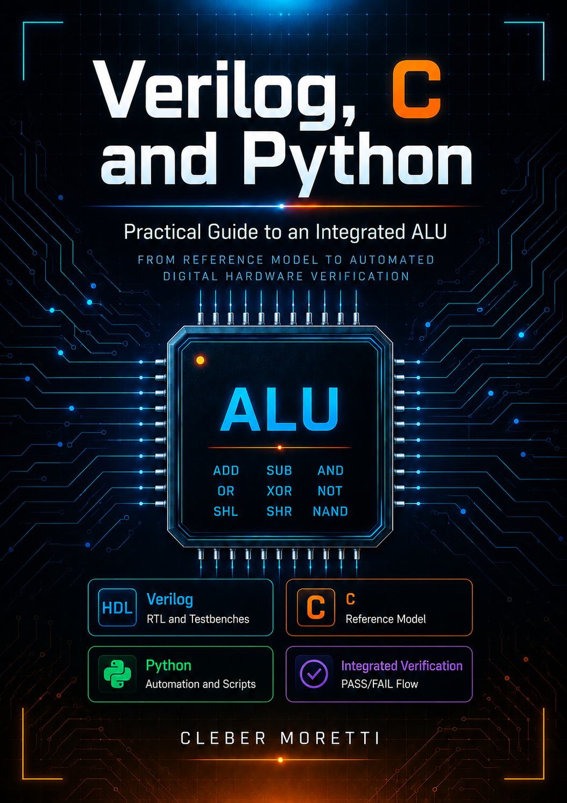

# ALU in Verilog, C and Python

🚧 This repository is a work in progress.


<p align="center">
  
  <br>
  <em>Figure 1 – ALU in Verilog, C and Python.</em>
</p>

---

## Overview

This repository presents a **practical study guide** for Verilog, C and Python using an ALU as the central project, with digital hardware concepts, reference models, and automated verification.

The goal is to build a complete and educational flow:

```text
C generates the expected results
Verilog implements the hardware
Python automates compilation, simulation and comparison
```
The content is divided into two volumes:

| Volume | File | Content |
| --- | --- | --- |
| Volume 1 | [`docs/verilog_c_python_alu_practical_guide_vol1.md`](docs/verilog_c_python_alu_practical_guide_vol1.md) | Fundamentals, 8-bit ALU, pthread, FSM, integrated flow |
| Volume 2 | [`docs/verilog_c_python_alu_practical_guide_vol2.md`](docs/verilog_c_python_alu_practical_guide_vol2.md) | NAND, 16-bit ALU, multi-cycle multiplication, division, FIFO, pipeline, synthesis in Vivado |

---

## Volumes

### Volume 1 — Fundamentals and integrated project

Covers everything from scratch up to a complete integrated project with an 8-bit ALU:

- Environment setup;
- C: functions, structs, enums, `uint8_t`, tests with `assert`, ALU reference model, concurrency with `pthread`;
- Python: automation with `subprocess` and `pathlib`, tests with `unittest`, ALU model, vector generation;
- Verilog: modules, `wire`, `reg`, `assign`, self-checking testbenches, combinational ALU, reading vectors from a file, simple FSM, advanced FSM with `valid/ready` handshake;
- Integrated project: C model + Verilog + Python + Makefile.

### Volume 2 — Advanced extensions with complete code

Starts from the Volume 1 project and evolves each component:

- **NAND**: C model, C test, Python test, Verilog RTL, testbench, vector generator, complete flow;
- **16-bit ALU**: with an `equal` flag and a comparison operation (`CMP`);
- **Testbench with operation name**: displays the name on failure, not just the code;
- **Pass-rate report**: Python script with a percentage per operation;
- **Multi-cycle multiplication**: shift-and-add in 8 cycles + FSM updated to wait for `done`;
- **Division with error handling**: `div_zero` signaling;
- **Parameterized FIFO**: C model, tests, RTL, testbench;
- **Pipeline with handshake**: input FIFO + sequential ALU + output FIFO, multiple operations in sequence;
- **Synthesis in Vivado**: closing the model → verify → synthesize cycle, with project, constraints (XDC), synthesis, implementation, bitstream, and Tcl automation.

---

## Tools Used

| Tool              | Role in the project                       |
| --------------    | --------------------------------------    |
| Verilog           | Implementation of the ALU and the FSMs    |
| C / GCC           | Reference model and vector generation     |
| Python 3          | Automation, comparison, and testing       |
| Icarus Verilog    | Hardware compilation and simulation       |
| GTKWave           | Waveform visualization                    |
| Make              | Simplified execution of the flow          |
| VSCode            | Editing and debugging the files           |
| Vivado 2025.2.1   | Synthesis (project, XDC, bitstream, Tcl)  |
| Pynq-Z2           | Xilinx FPGA Board                         |

---

## Repository Structure

```text
Verilog_C_Python_ALU_Guide/
|
├── assets/
│   └── cover.png
│
├── docs/
│   ├── verilog_c_python_alu_practical_guide_vol1.md
│   └── verilog_c_python_alu_practical_guide_vol2.md
│
├── examples/
│   ├── c/
│   ├── python/
│   └── verilog/
│
├── integrated_alu_project/
│   ├── c_model/
│   │   ├── alu_model.h          # 8-bit ALU (Vol. 1)
│   │   ├── alu_model.c
│   │   ├── alu16_model.h        # 16-bit ALU (Vol. 2)
│   │   ├── alu16_model.c
│   │   ├── mul8_model.h         # Multiplier (Vol. 2)
│   │   ├── mul8_model.c
│   │   ├── div8_model.h         # Divider (Vol. 2)
│   │   ├── div8_model.c
│   │   ├── fifo_model.h         # FIFO (Vol. 2)
│   │   ├── fifo_model.c
│   │   ├── test_alu_model.c
│   │   ├── test_alu16_model.c
│   │   ├── test_mul8_model.c
│   │   ├── test_div8_model.c
│   │   ├── test_fifo_model.c
│   │   ├── gen_vectors.c
│   │   └── gen_vectors_parallel.c  # Parallel generator with pthread (Vol. 1)
│   │
│   ├── rtl/
│   │   ├── alu8.v               # 8-bit ALU + NAND operation (Vol. 1 base, Vol. 2 widens op to 4 bits)
│   │   ├── alu8_seq.v           # Sequential ALU with FSM (Vol. 1)
│   │   ├── alu16.v              # 16-bit ALU (Vol. 2)
│   │   ├── mul8.v               # Multi-cycle multiplier (Vol. 2)
│   │   ├── alu8_seq_mul.v       # FSM with multiplication support (Vol. 2)
│   │   ├── div8.v               # Divider with div_zero (Vol. 2)
│   │   ├── fifo8.v              # Parameterized FIFO (Vol. 2)
│   │   └── alu_pipeline.v       # Complete pipeline (Vol. 2)
│   │
│   ├── sim/
│   │   ├── tb_alu8_file.v
│   │   ├── tb_alu16.v
│   │   ├── tb_alu16_named.v     # Displays operation name on error
│   │   ├── tb_mul8.v
│   │   ├── tb_alu8_seq_mul.v
│   │   ├── tb_div8.v
│   │   ├── tb_fifo8.v
│   │   └── tb_alu_pipeline.v
│   │
│   ├── scripts/
│   │   ├── run_all.py
│   │   ├── compare_results.py
│   │   ├── test_compare_results.py
│   │   └── test_alu_python.py
│   │
│   ├── synth/                   # Vivado (Vol. 2, Chap. 12)
│   │   ├── alu_pipeline.xdc     # example constraints, adjust for your board
│   │   └── build_alu8.tcl       # automation script (vivado - mode batch)
│   │
│   ├── build/
│   └── Makefile
│
├── .editorconfig
├── .gitattributes
├── .gitignore
|
├── License
└── README.md
```

> Files marked with `(Vol. 2)` are introduced or updated in Volume 2. The remaining ones are built throughout Volume 1.

---

## ALU Operations

### Volume 1 — 8-bit ALU

| Code | Operation | Description |
| ---- | --------- | ----------- |
| 0    | ADD       | A + B       |
| 1    | SUB       | A - B       |
| 2    | AND       | A & B       |
| 3    | OR        | A \| B      |
| 4    | XOR       | A ^ B       |
| 5    | NOT       | ~A          |
| 6    | SHL       | A << 1      |
| 7    | SHR       | A >> 1      |

### Volume 2 — Expanded 8-bit ALU + 16-bit ALU

| Module                  | Code | Operation | Description                                         |
| ----------------------- | ---- | --------- | --------------------------------------------------- |
| alu8 / alu8_seq_mul     | 8    | NAND      | ~(A & B)                                            |
| alu16                   | 9    | CMP       | `0x0000` if equal, `0x0001` if A>B, 0xFFFF if A<B   |
| alu8_seq_mul            | 9    | MUL       | A × B (multi-cycle, 8 cycles)                       |


> ⚠️ Code `9` is reused across different modules (`alu16` for `CMP`, `alu8_seq_mul` for `MUL`). This does not cause a conflict because each module has its own isolated `op` field, but keep it in mind when reading the table: operation codes are **not global**; they are specific to each ALU.

### Flags

| Flag       | Vol. 1 | Vol. 2 | Description                                |
| ---------- | ------ | ------ | ------------------------------------------ |
| zero       | ✅     | ✅     | Result equals zero                         |
| carry      | ✅     | ✅     | Carry on addition or borrow on subtraction |
| negative   | ✅     | ✅     | Most significant bit of the result is 1    |
| overflow   | ✅     | ✅     | Signed arithmetic overflow                 |
| equal      | —      | ✅     | A == B (16-bit ALU)                        |
| div_zero   | —      | ✅     | Division by zero detected                  |

---

## Verification Flow

### Volume 1

```text
1. Python compiles and runs the C model tests
2. C generates the input vectors and the expected results
3. Python compiles the Verilog ALU with Icarus Verilog
4. The testbench applies the vectors and records the obtained results
5. Python compares the expected results with the simulated results
6. The flow reports PASS or FAIL
```

### Volume 2 (expanded flow)

```text
1. Python compiles and runs the C tests for all modules
2. C generates vectors for the 8-bit ALU with NAND
3. Python runs the Python unit tests
4. Python compiles and simulates: ALU8, ALU16, MUL, FSM+MUL, DIV, FIFO, Pipeline
5. Python generates a report with the pass percentage per operation
6. The flow reports PASS or FAIL
```

---

## Installation

On Linux or WSL:

```bash
sudo apt update
sudo apt install iverilog gtkwave gcc make gdb python3 python3-venv python3-pip
```

Verify the installation:

```bash
iverilog -V
vvp -V
gcc --version
python3 --version
make --version
```
---

## Running the Project

```bash
cd integrated_alu_project
make run
```

Additional commands:

| Command                 | Purpose                                 |
| ----------------------- | --------------------------------------- |
| `make run`              | Runs the complete flow                  |
| `make test`             | Runs all C and Python tests             |
| `make test_c`           | Runs only the C unit tests              |
| `make test_python`      | Runs only the Python unit tests         |
| `make sim_alu8`         | Simulates the 8-bit ALU                 |
| `make sim_alu16`        | Simulates the 16-bit ALU                |
| `make sim_mul8`         | Simulates the multi-cycle multiplier    |
| `make sim_alu8_seq_mul` | Simulates the FSM with multiplication   |
| `make sim_div8`         | Simulates the divider                   |
| `make sim_fifo`         | Simulates the FIFO                      |
| `make sim_pipeline`     | Simulates the pipeline with handshake   |
| `make waves`            | Opens the waveforms in GTKWave          |
| `make clean`            | Removes the generated files in `build/` |

---

## Suggested Study Path

### Volume 1

1. Study the basic examples in C, Python and Verilog.
2. Implement and test the ALU reference model in C.
3. Run the basic ALU testbench in Verilog.
4. Use the vector file for automated tests.
5. Implement the simple FSM and then the FSM with handshake.
6. Explore the parallel vector generator with `pthread`.
7. Run the complete integrated flow with `make run`.

### Volume 2

1. Add NAND and run the complete flow from scratch.
2. Expand to the 16-bit ALU with `equal` and `CMP`.
3. Update the testbench to display operation names.
4. Implement the pass-rate report per operation.
5. Implement the multi-cycle multiplier and update the FSM.
6. Add division with error handling.
7. Implement the FIFO and assemble the pipeline with handshake.
8. Run `make run` and confirm PASS on all modules.
9. Introduce a deliberate bug and use the testbench to find it.
10. Synthesize one of the modules in Vivado and read the utilization report.

---

## Future Improvements

- Study Hardware Trojans in an ALU (insertion and detection)

---

## License

This project is open-source and available under the GNU General Public License v3.0 (GPLv3).

---

## Additional Notes

This repository was designed as practical learning material. The main goal is not just to implement an ALU, but to study a method that can be reused in larger projects:

```text
understand -> implement -> test -> automate -> integrate -> evolve
```
